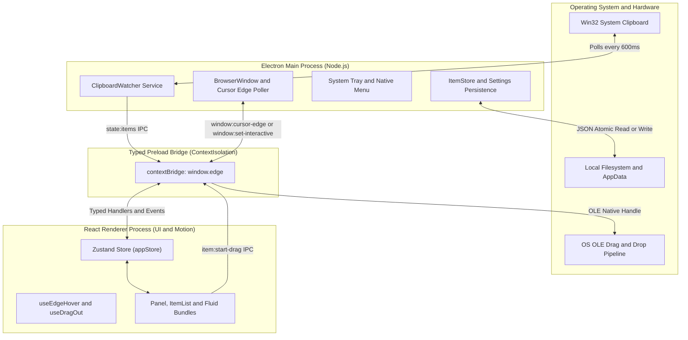
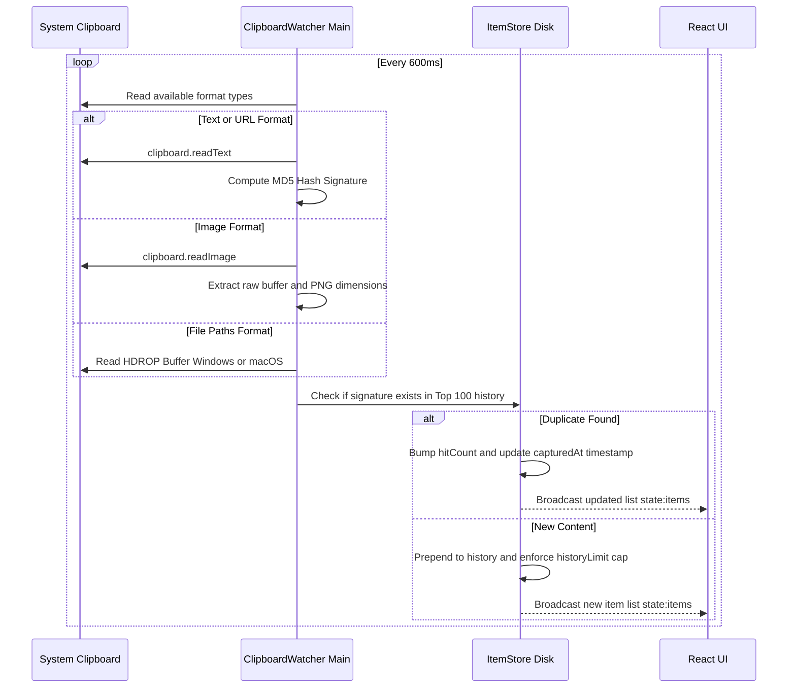
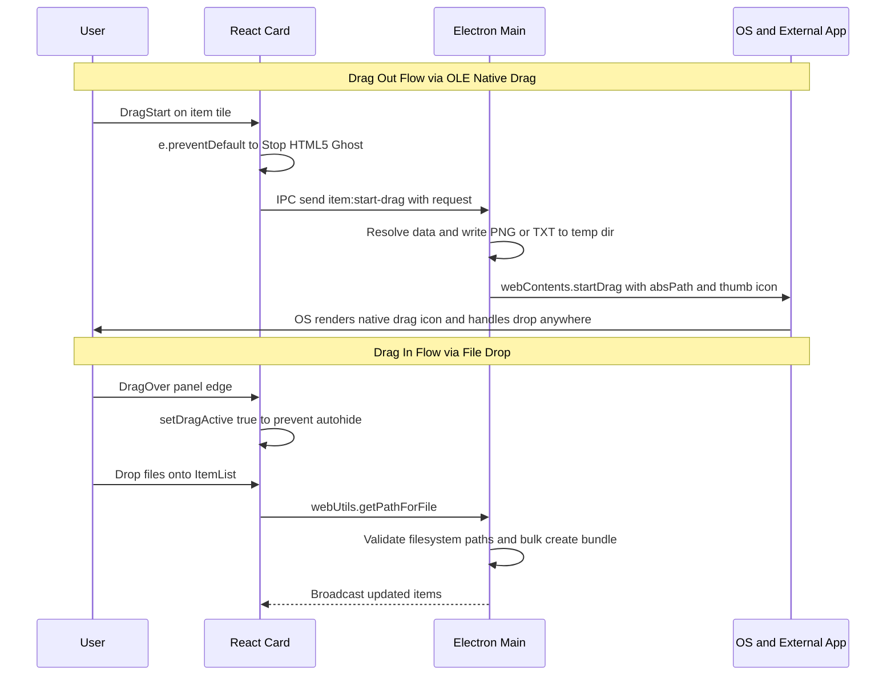

# Edge-Drop — Technical Features & Architecture Specification

This document provides an exhaustive, engineering-grade breakdown of the architecture, subsystems, data flows, and technical mechanisms that power **Edge-Drop** — a minimalist, always-accessible, hover-activated desktop clipboard shelf built with Electron, React, TypeScript, and Framer Motion.

---

## 1. Executive Summary & System Philosophy

Edge-Drop is designed around a single guiding user-experience principle: **zero-friction, non-intrusive accessibility**. Traditional clipboard managers require manual keyboard shortcuts (like `Win+V`) or system-tray clicking, breaking flow and visual concentration. Edge-Drop eliminates this friction by residing completely hidden as a 0-pixel interactive trigger zone along the leftmost screen edge. When approached by the cursor, it dynamically reveals itself through fluid spring physics, allowing instant drag-and-drop operations across desktop applications.

### Architectural Highlights
* **Zero-Latency State Rendering**: Direct store reads (`useStore.getState()`) combined with boolean Zustand selectors ensure that dragging and dropping items never triggers cascading React re-renders across long lists.
* **Hardened Sandbox Security**: Operates with `contextIsolation: true`, `nodeIntegration: false`, and a strongly typed, bidirectional TypeScript IPC bridge (`contextBridge.exposeInMainWorld`).
* **OS-Level OLE Native Dragging**: Bypasses browser-only HTML5 drag limitations by generating temporary OS file handles and invoking Electron's native `startDrag` pipeline, allowing seamless drops into desktop software such as Adobe Photoshop, Microsoft Word, and Windows Explorer.

---

## 2. Core System Architecture & IPC Bridge

Edge-Drop enforces a strict decoupling between the system-level OS integrations (Main Process) and the presentation/animation layer (Renderer Process).



### The Typed IPC Contract ([ipc.ts](file:///c:/Users/yadav/OneDrive/Desktop/projects/Edge-Drop/shared/ipc.ts))
To prevent drift between processes, all communication occurs over three statically typed maps:
1. **`InvokeMap`** (Request/Response): Asynchronous operations where the renderer expects a result from Node.js (e.g., `state:load`, `item:delete`, `item:merge`, `settings:update`).
2. **`EventMap`** (Main $\rightarrow$ Renderer): Real-time broadcast signals initiated by the background services (e.g., `state:items`, `window:cursor-edge`, `ui:toast`).
3. **`SendMap`** (Fire-and-Forget): Time-critical, synchronous gestures. The primary use case is `item:start-drag`, where the renderer must immediately yield execution to allow Node.js to claim the OS drag event loop without waiting for a round-trip Promise resolution.

---

## 3. The Invisible Edge-Trigger Architecture

Achieving a "click-through when hidden, interactive when visible" frameless window on modern operating systems without flickering requires a multi-layered hysteresis algorithm.

```mermaid
stateDiagram-v2
    [*] --> Closed: Startup at x=0, Width=280px, Click-Through
    
    state Closed {
        [*] --> PollingEdge
        PollingEdge --> TriggerZone: Cursor x <= 3px in hot zone
        TriggerZone --> DwellTimer: Linger >= 120ms
        DwellTimer --> Open: Timer expires
    }

    state Open {
        [*] --> Interactive: Set interactive true
        Interactive --> HysteresisCheck: 16ms Main Process Poll
        HysteresisCheck --> Interactive: Cursor x <= 255px inside Blade
        HysteresisCheck --> GraceTimer: Cursor x > 290px OR Left y-bounds
        GraceTimer --> Interactive: Cursor returns before 250ms
        GraceTimer --> Closed: Timer expires and setOpen false
    }
```

### 1. Main-Process 16ms Screen Polling
Standard DOM `pointerleave` events are notoriously unreliable when applied to transparent Electron windows with dynamic shape-masking (`setIgnoreMouseEvents`). Instead, Edge-Drop runs a native background polling timer in the Main process using `screen.getCursorScreenPoint()`. Every 16ms, it evaluates the exact physical cursor coordinates and broadcasts `window:cursor-edge` to the renderer.

### 2. Dual-Threshold Dead-Band Hysteresis ([useEdgeHover.ts](file:///c:/Users/yadav/OneDrive/Desktop/projects/Edge-Drop/src/hooks/useEdgeHover.ts))
To prevent rapid visual oscillation (flickering open and closed) when a user's hand hovers precariously at the exact outer boundary of the clipboard shelf (~270px), Edge-Drop implements a dead-band hysteresis algorithm:
* **`TRIGGER_PX` (3px)**: The leftmost strip of screen pixels that initiates the `DWELL_MS` (120ms) opening timer.
* **`KEEP_OPEN_PX` (255px)**: If the cursor x-coordinate is $\le 255\text{px}$, the panel is guaranteed to be inside the visual blade; any pending close timers are immediately canceled.
* **`START_CLOSE_PX` (290px)**: Only when the cursor moves beyond $290\text{px}$ ($20\text{px}$ outside the visual boundary of the shelf) does the system schedule the `GRACE_MS` (250ms) close timer.
* **The Dead Band ($255\text{px} < x \le 290\text{px}$)**: Cursor movement within this 35-pixel buffer is ignored, allowing smooth natural hand micro-tremors without accidentally triggering state transitions.

### 3. Dynamic Shape Masking (`setIgnoreMouseEvents`)
When the shelf is closed, the window must not block clicks meant for underlying desktop applications (like web browsers or IDEs). Edge-Drop invokes `window:set-interactive(false)` over IPC, which calls `win.setIgnoreMouseEvents(true, { forward: true })`. When the dwell timer triggers an open event, it immediately switches to `win.setIgnoreMouseEvents(false)`, capturing all mouse clicks, scrolls, and drag gestures.

---

## 4. Multi-Format Clipboard Capture Engine

The background service [ClipboardWatcher.ts](file:///c:/Users/yadav/OneDrive/Desktop/projects/Edge-Drop/electron/clipboard/ClipboardWatcher.ts) continuously monitors the system clipboard without relying on brittle OS polling hooks that degrade CPU performance.



### Signature Generation & Deduplication
Every captured clipboard entry is processed to generate a deterministic content signature:
* **Text/Links**: SHA-256 or MD5 hash of the normalized UTF-8 string.
* **Images**: Hash of the raw bitmap buffer combined with pixel dimensions (`width × height × bytes`).
* **Files**: Sorted array concatenation of absolute file system paths.

If a signature matches an existing item already present in the history store, Edge-Drop **deduplicates** the entry by elevating it back to the top of the shelf, updating its `capturedAt` timestamp, and incrementing its badge multiplier (`hitCount`), keeping the workspace clean.

---

## 5. Fluid Collections & Stack Bundling

To prevent mass file copying or multi-image screenshots from cluttering the shelf with dozens of individual cards, Edge-Drop introduces **Fluid Bundles**.

### 1. Automatic Collection Grouping (`image-collection` & `files`)
When a user drags multiple items simultaneously into the panel (or copies a multi-file selection from Explorer), the `ItemStore` groups them into a single parent entity:
* **Collapsed Visual State**: Displays an angled 3D card stack (`bundle-stack-large`) showing up to 4 overlapping thumbnails with progressive rotation and scaling offsets (`zIndex: 10 - idx`, `rotate: idx * 6 - 6`).
* **Expanded Visual State**: Clicking the bundle body smoothly expands the card via Framer Motion's `popLayout` engine, revealing an interactive sub-item list.

### 2. Granular Sub-Item Manipulation
Once a bundle is expanded, users can interact with individual internal elements without breaking the parent collection:
* **Sub-Item Dragging**: Dragging a single row out of an expanded bundle initiates a focused drag request (`{ id, imageId }` or `{ id, paths: [singlePath] }`), transferring only that specific file to the target OS application.
* **Sub-Item Splitting / Ungrouping**: Clicking the minus icon (`item:split`) detaches the sub-item from the collection and promotes it into an independent, top-level item card on the shelf.
* **Interactive Drag-Over Merging**: Dragging an external item card directly over an existing card on the shelf fires `window.edge.mergeItems(sourceId, targetId)`, automatically combining separate items into a unified collection stack.

---

## 6. OS-Level Native Drag-in & OLE Drag-out

Edge-Drop seamlessly bridges the web technology stack of Electron's renderer with low-level OS file transfer protocols.



### Why Bypassing HTML5 Drag is Required
In a standard web browser, dragging an image out of a window only passes a URL or a Base64 string. Desktop software (like Adobe Illustrator, Slack, or File Explorer) expects actual filesystem paths via OS drag-and-drop protocols (CF_HDROP on Windows, NSFilenamesPboardType on macOS).

When a drag begins on a `ClipboardItemCard`:
1. The renderer calls `e.preventDefault()` on the native HTML5 drag event to prevent the browser from rendering an empty drag image.
2. It synchronously dispatches `item:start-drag` to Node.js.
3. If the item is an in-memory image or text snippet, the Main process writes it to a clean temporary file (`C:\Users\<user>\AppData\Roaming\edge-drop\temp\item-<id>.png`).
4. Node.js invokes `event.sender.startDrag({ file: absPath, icon: nativeImageThumb })`, handing full control over to the Windows OLE Drag loop.

---

## 7. UI/UX & Motion Design System

The visual language of Edge-Drop is inspired by modern dark-mode aesthetics—deep black backgrounds (`#000000`), frosted glass backdrops (`backdrop-filter: blur(20px)`), subtle 1px hairlines (`rgba(255, 255, 255, 0.08)`), and high-contrast typography.

### 1. Synchronized Elastic Overshoot Bounce ([Panel.tsx](file:///c:/Users/yadav/OneDrive/Desktop/projects/Edge-Drop/src/components/Panel.tsx))
When the panel opens, it does not simply slide into place; it exhibits physical elasticity. In `Panel.tsx`, the outer wrapper (`.blade-container`) is animated with keyframes:
```json
{
  "scale": [0.92, 1.05, 0.98, 1],
  "transition": { "duration": 0.55, "ease": [0.22, 1, 0.36, 1] }
}
```
By anchoring the transform origin to the left screen edge (`originX: 0, originY: 0.5`), the entire shelf—including its content and curved connection flares—scales outward by **+5%** before snapping back into its exact resting dimensions.

### 2. Synchronized Screen-Edge Connection Flares
To make the shelf appear physically extruded from the user's monitor bezel, two custom SVG reverse curves (`.flare-top` and `.flare-bottom`) sit at the top and bottom intersection points. Because these flares are positioned inside the scaling `.blade-container` wrapper rather than the inner clipped panel, they animate and stretch in perfect unison with the bounce animation.

### 3. Scroll Gradient Masks
Both the main clipboard history list (`ItemList`) and the settings configuration view (`Settings`) feature top and bottom 18px absolute linear gradient overlays (`linear-gradient(to bottom, #000000, transparent)`). As items scroll under the fixed Header or Footer, they smoothly fade into the deep black background rather than clipping sharply against border edges.

---

## 8. High-Legibility Settings & Persistence

The settings panel replaces traditional, clumsy UI sliders with clean **Minimalist Pill Selectors** (`.setting-pills`) and sleek custom toggle switches.

| Setting Option | Internal Key | Default | Description |
|---|---|---|---|
| **Clear unpinned on restart** | `clearUnpinnedOnRestart` | `false` | Automatically purges all non-pinned history upon device reboot. |
| **Auto-delete timer** | `autoDeleteHours` | `0` (Never) | Purges copied items older than 1h, 6h, 24h, or 7 days (preserves Pinned items). |
| **History capacity** | `historyLimit` | `500` | Limits unpinned storage depth (options: 100, 250, 500, 1000 items). |
| **Edge trigger height** | `hotZoneHeight` | `0.4` (40%) | Adjusts the vertical hover detection band along the screen edge (25%, 40%, 60%). |
| **Panel height** | `panelHeight` | `0.65` (65%) | Adjusts the visual height of the clipboard blade relative to screen resolution. |
| **Incognito mode** | `incognito` | `false` | Temporarily suspends clipboard polling; no new items are captured while active. |
| **Launch at login** | `launchAtLogin` | `false` | Registers Edge-Drop silently in the Windows Registry (`CurrentVersion\Run`). |

### Atomic JSON Persistence ([settings.ts](file:///c:/Users/yadav/OneDrive/Desktop/projects/Edge-Drop/electron/store/settings.ts) & [ItemStore.ts](file:///c:/Users/yadav/OneDrive/Desktop/projects/Edge-Drop/electron/store/ItemStore.ts))
All user data is stored inside Electron's `app.getPath('userData')` directory (`C:\Users\<user>\AppData\Roaming\edge-drop`). To prevent data corruption during sudden system crashes or power loss, disk write operations utilize safe atomic file writing techniques (writing to a temporary file before renaming it over the destination target).

---

## 9. Hardened Security & Sandbox Isolation

Edge-Drop is built to strict enterprise desktop security standards:
* **`nodeIntegration: false`**: The React renderer has zero access to Node.js APIs, file systems, or OS execution modules.
* **`contextIsolation: true`**: Preload scripts run in a separate JavaScript execution context, protecting the Main process from prototype pollution or cross-site scripting (XSS) injection attempts.
* **Windows Startup Dev-Mode Safety**: All calls to `app.setLoginItemSettings()` are wrapped in explicit `if (app.isPackaged)` safety guards. This guarantees that running local development servers (`npm run dev`) will never inject bare development binaries (`electron.exe`) into the Windows Registry startup keys.

---

## 10. Summary of Features Matrix

| Category | Feature Name | Capability Breakdown |
|---|---|---|
| **Activation** | Zero-Click Edge Hover | Hovers into view from 0px edge width; click-through when hidden. |
| **Activation** | Hysteresis Hiding | Dual-threshold dead band (255px / 290px) prevents boundary oscillation. |
| **Capture** | Multi-Format Support | Captures plain text, rich URLs, bitmaps/PNGs, and multi-file paths. |
| **Capture** | Smart Deduplication | Elevates existing items and increments `hitCount` badge on re-copy. |
| **UI/UX** | Elastic Overshoot Bounce | Entire panel and connection arcs scale +5% with spring physics on reveal. |
| **UI/UX** | Monochrome Aesthetics | Frosted deep black macOS-style panels with subtle white/silver badges. |
| **UI/UX** | Fluid Bundles | Groups multi-file/image copies into expandable 3D card stacks. |
| **Manipulation** | Granular Sub-Item Actions | Drag out, copy, or split individual files directly from inside a bundle. |
| **Manipulation** | Interactive Merging | Drag and drop shelf items onto one another to combine them into stacks. |
| **OS Transfer** | OLE Native Drag-Out | Direct OS file handle generation for dragging into Word, Explorer, etc. |
| **OS Transfer** | Protected Drag-In | Shelf stays locked open when dragging OS files over the target drop zone. |
| **Configuration** | Pill Selector Settings | Instant, slider-free configuration for capacity, hot zones, and timers. |
| **System** | Dev-Safe Login Startup | Safe Windows startup registration protected against dev-mode binaries. |
