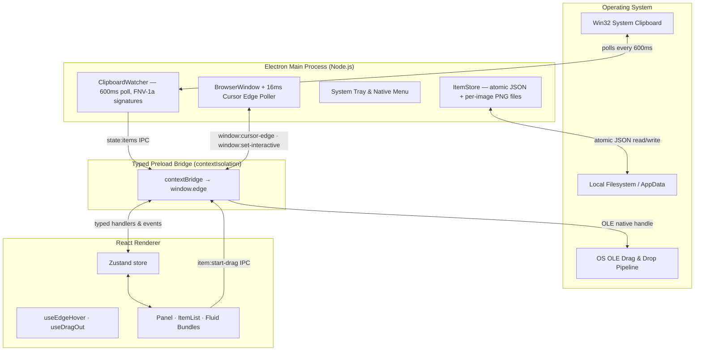
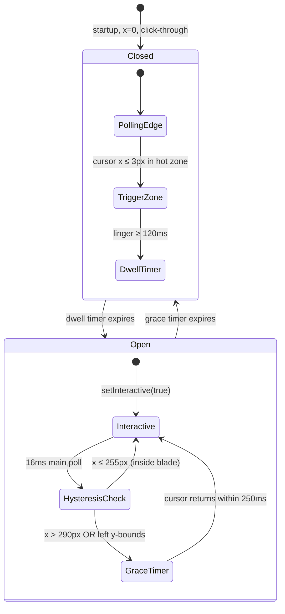
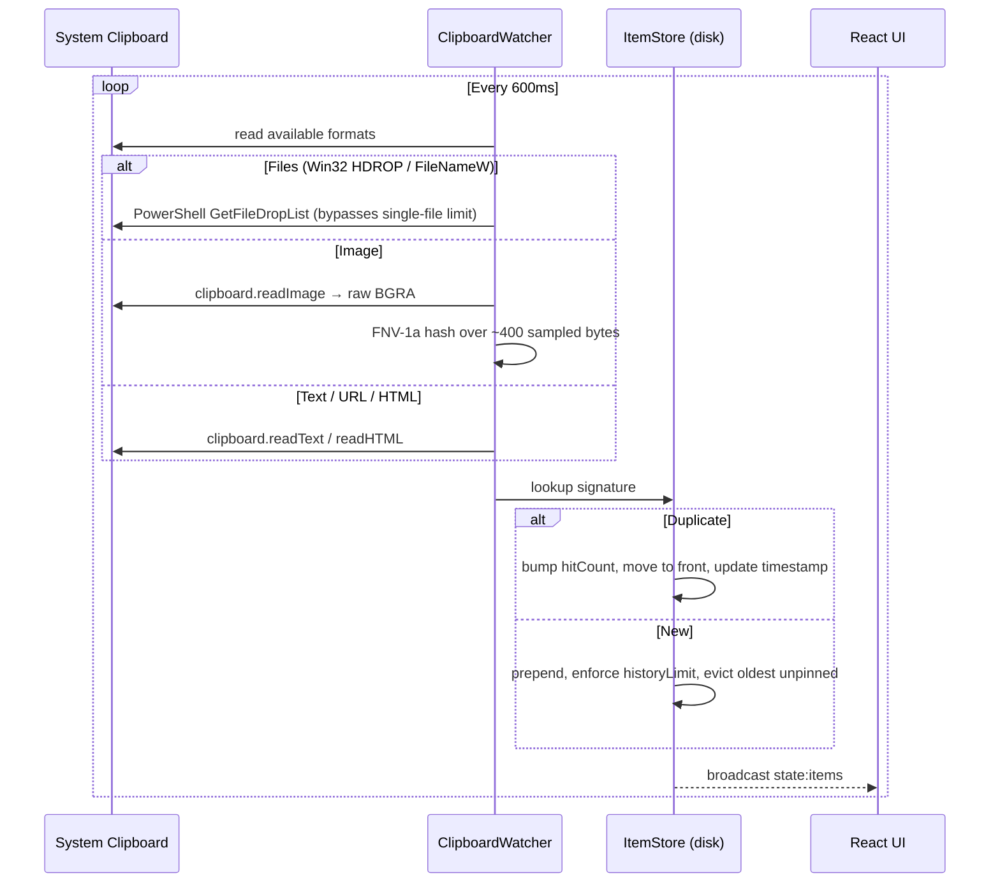
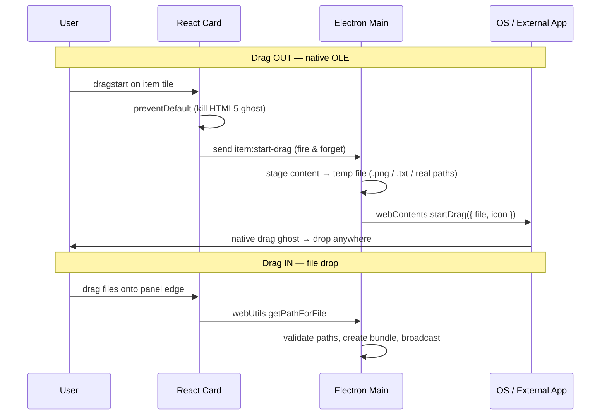

<p align="center">
  
</p>

<h1 align="center">Edge-Drop</h1>

<p align="center">
  <strong>A zero-click, hover-activated clipboard shelf and native OS file-transfer hub for the desktop.</strong><br/>
  Lives invisibly on the left edge of your screen. Approach it, and it opens. Drag anything out — into Photoshop, Word, Slack, Explorer, anywhere.
</p>

<p align="center">
  <a href="#quick-start">Quick Start</a> ·
  <a href="#demos">Demos</a> ·
  <a href="#how-it-works">How It Works</a> ·
  <a href="#architecture">Architecture</a> ·
  <a href="#security">Security</a> ·
  <a href="#roadmap">Roadmap</a> ·
  <a href="#contributing">Contributing</a>
</p>

<p align="center">
  <sub>Built with Electron · React · TypeScript · Framer Motion · Zustand</sub><br/>
  <sub>License: Apache-2.0 &nbsp;·&nbsp; Status: Public Beta</sub>
</p>

---

## Why

Every clipboard manager on the market breaks your flow. You copy something, switch apps, paste, then hunt through `Win+V` history with arrow keys or dig into a tray menu. Multi-step. Modal. Slow.

**Edge-Drop removes the friction.** It anchors to the leftmost pixel of your monitor as a transparent, always-on-top, click-through surface. When your cursor approaches the edge, the shelf springs open. Drag images, file stacks, rich text, and HTML bundles *out* of it — directly into whatever desktop app you're already using. No shortcuts. No window switching. No modal dialogs.

It is built for the developer and creative workflow where you constantly juggle screenshots, code snippets, file paths, design assets, and reference links between many windows at once.

---

## Demos

> All demos are silent autoplay loops. Hover to scrub, right-click → open in new tab for full size.

<table>
  <tr>
    <td width="50%" align="center"><b>1. Welcome to Edge-Drop</b><br/><br/>
      <video src="https://github.com/user-attachments/assets/118d59cc-9821-4da1-9424-ea9bc1b6e548" width="100%" autoplay loop muted playsinline></video>
    </td>
    <td width="50%" align="center"><b>2. Collect Anything</b><br/><br/>
      <video src="https://github.com/user-attachments/assets/8daa18a7-d023-4e93-9f17-c30791a7c41c" width="100%" autoplay loop muted playsinline></video>
    </td>
  </tr>
  <tr>
    <td width="50%" align="center"><b>3. Drag & Drop Anywhere</b><br/><br/>
      <video src="https://github.com/user-attachments/assets/ac8bc411-0827-460c-828c-0799f4cee4d8" width="100%" autoplay loop muted playsinline></video>
    </td>
    <td width="50%" align="center"><b>4. Explore File Stacks</b><br/><br/>
      <video src="https://github.com/user-attachments/assets/b1e47a2b-41d2-4958-8e42-4fefcaa8b26b" width="100%" autoplay loop muted playsinline></video>
    </td>
  </tr>
  <tr>
    <td width="50%" align="center"><b>5. Ungroup & Split Stacks</b><br/><br/>
      <video src="https://github.com/user-attachments/assets/e41eb9f8-62b0-4525-a28a-2bacafd0bb8c" width="100%" autoplay loop muted playsinline></video>
    </td>
    <td width="50%" align="center"><b>6. Combine & Merge Items</b><br/><br/>
      <video src="https://github.com/user-attachments/assets/cee7d5f7-658b-433a-9fa0-6592a5a75fa4" width="100%" autoplay loop muted playsinline></video>
    </td>
  </tr>
</table>

---

## Quick Start

### Prerequisites
- **Node.js** v18 or higher
- **OS**: Windows 10/11 (uses Win32 OLE drag pipelines and transparent-window cursor polling)

### Run from source
```bash
git clone https://github.com/Deepender25/Edge-Drop.git
cd Edge-Drop
npm install
npm run dev          # launches Electron + Vite HMR
```

### Type-check
```bash
npm run typecheck    # runs tsc --noEmit against both node and web configs
```

### Build Windows installers
```bash
npm run build:github # outputs an NSIS .exe for GitHub releases
npm run build:store  # outputs an MSIX .appx for Microsoft Store submission
```

> [!NOTE]
> On Windows, if packaging fails with `EBUSY: resource busy or locked`, close any running Edge-Drop instances first: `taskkill /F /IM electron.exe /T`.

---

## How It Works

Edge-Drop is an Electron app split into three strictly isolated processes — **Main** (Node.js, OS access), **Preload** (typed sandbox bridge), and **Renderer** (React UI). They communicate over a fully typed IPC contract. No string channel names, no `any` payloads.

### The invisible edge trigger

The shelf stays hidden as a frameless, transparent, click-through `BrowserWindow` anchored at `x=0`. When collapsed, **all mouse events pass through to the apps beneath it** — your desktop is 100% usable. Detection happens in the Main process via a 16ms `screen.getCursorScreenPoint()` poll, because Windows transparent windows silently drop `pointermove` forwarding.

A **dead-band hysteresis state machine** prevents the shelf from flickering open/closed when your cursor hovers near its boundary:

| Threshold | Value | Meaning |
|---|---|---|
| Trigger Zone | `x ≤ 3px` | A 3-pixel strip on the left edge starts a 120ms dwell timer |
| Keep-Open | `x ≤ 255px` | Cursor clearly inside the blade → cancel any close timer |
| Dead Band | `255px < x ≤ 290px` | Micro-tremors here are ignored — no action |
| Start-Close | `x > 290px` | Cursor clearly outside → 250ms grace timer begins |

This is the kind of detail that separates a "looks nice" demo from a tool you can actually live with.

### Multi-format clipboard engine

The `ClipboardWatcher` polls the OS clipboard every 600ms. To detect *change* without re-encoding images on every tick, it computes a cheap content signature:

- **Files** → joined path list
- **Text** → the text itself
- **Images** → an **FNV-1a hash over ~400 sampled bytes of the raw BGRA bitmap** (dimensions + hash)

The previous naive approach of comparing `toPNG().length` was both expensive (re-encoded the whole image each tick) and broken (two different 1920×1080 screenshots of similar complexity produced identical byte counts → the second was silently dropped). The FNV-1a sampler is O(400) regardless of image size and has astronomically low collision probability.

It also **respects privacy flags**. Clipboard formats from password managers and dictation tools — `ExcludeClipboardContentFromMonitorProcessing`, `ClipboardViewerIgnore`, `CanIncludeInClipboardHistory=0`, `KeePassClipFormat`, `com.bitwarden.concealed`, etc. — are matched case-insensitively and skipped entirely.

### Native OS drag-out (OLE)

Standard HTML5 drag events cannot hand file handles to external desktop software. Edge-Drop intercepts the renderer's `dragstart`, sends a fire-and-forget IPC (`item:start-drag`) to the Main process, which stages the item's content as a temp file and calls `webContents.startDrag({ file, icon })`. The OS then renders a native drag ghost and handles the drop into Photoshop, Word, Explorer, or any other app — exactly as if you had dragged the file from Explorer itself.

Custom drag icons are generated on the fly: stacked card PNGs for file bundles (with a count badge), glassmorphic quote cards for text, real image thumbnails for images. Rendered via `@resvg/resvg-js`, cached, and pre-warmed on startup so the first drag is instant.

### Smart deduplication, stacks, and merging

When you re-copy existing content, Edge-Drop doesn't add a duplicate — it bumps the item to position 0, increments its `hitCount` badge, and refreshes its timestamp. Multi-file drag-ins and multi-image copies auto-group into expandable 3D card stacks (max 10 per stack). Drag any item card over another to merge them into a bundle; double-click to expand and drag a sub-item to the left edge to split it back out.

---

## Architecture



### Edge-trigger state machine



### Clipboard capture & dedup pipeline



### Native drag-out flow



---

## Features

**Zero-click edge hover**
- Frameless, transparent, always-on-top `BrowserWindow` anchored at `x=0`
- 100% click-through when collapsed — desktop stays fully usable
- Configurable hot-zone height (25% / 40% / 60% of screen) and blade height (40% – 100%)
- **Multi-monitor support:** Pick exactly which display the panel sticks to, with options for Left or Right screen edges.
- **Ultra-lightweight:** Optimized memory footprint (~60% reduced RAM) using custom `edgelocal://` streaming protocols and compressed WebM assets.

**Multi-format clipboard engine**
- Captures plain text, URLs, rich HTML, raw images, and multi-file selections
- Win32 `FileNameW` / HDROP parsing via PowerShell to bypass Electron's single-file limit
- Respects password-manager and dictation-tool privacy flags (case-insensitive matching)
- Smart deduplication — re-copies bump `hitCount` and move the item to the top
- Incognito mode — one click suspends polling for sensitive data

**Native OS drag & drop**
- `webContents.startDrag()` hands real file handles to external apps
- Custom drag icons: stacked card PNGs with count badges, glassmorphic text cards, real image thumbnails
- Drag-in: drop files onto the shelf to add them; drag-out: drop anywhere — Photoshop, Word, Explorer, Slack
- Pre-warmed icon cache so the first drag is instant

**Fluid collections & stacks**
- Auto-group multi-file drag-ins and multi-image copies into 3D card stacks (max 10)
- **Preview Flyout Drag-to-Stack**: Drag any shelf item directly onto an open Preview Flyout to stack and merge them seamlessly
- Double-click to expand, drag a sub-item to the left edge to split it back out
- Type-safe merge rules: images only merge with images, files with files (text never groups)

**UI / UX**
- **Dynamic Preview Flyout**: Responsive 100% full-width (`1fr`) layout for single files, 2-column grid for multi-file collections
- **Unified Image Rendering**: Copied image files (`.png`, `.jpeg`, `.gif`, `.webp`) render as visual image cards with thumbnails on the shelf and display full visual image previews in flyouts
- **High-Contrast Overlays**: Solid dark `rgba(0, 0, 0, 0.85)` copy button overlays with glassmorphic backdrop blur over images
- Frosted-glass macOS aesthetic — deep black, `backdrop-filter: blur(20px)`, hairline borders
- Framer Motion adaptive spring physics (`useAdaptiveSpring`) synchronized with screen refresh rates
- Custom SVG connection flares that scale with the blade
- Scroll gradient masks top & bottom to fade items into black
- Monochrome pin / multiplier badges for maximum legibility
- Reduce-motion setting for accessibility

---

## Security

Edge-Drop touches the OS clipboard, the filesystem, and the Win32 OLE drag pipeline — so the security posture is intentional, not optional.

| Control | Implementation |
|---|---|
| Modern Runtime | **Electron 34.2.0+** — Patches EOL Chromium memory corruption and RCE vectors |
| Encrypted Storage | **Windows DPAPI `safeStorage`** — Plaintext history (`items.json`) encrypted at rest with user-session DPAPI keys & zero-data-loss auto-migration (`.bak` backups) |
| Process Isolation | `contextIsolation: true` · `nodeIntegration: false` · `sandbox: true` on all browser windows |
| PowerShell Hardening | Absolute executable path `${SystemRoot}\System32\WindowsPowerShell\v1.0\powershell.exe`, non-blocking `execFile`, strict path validation (`pathValidation.ts`), and queue deadlock protection |
| Protocol Confinement | `edgelocal://` canonical path resolution (`path.resolve()`) strictly confined within `%APPDATA%/Edge-Drop/images/` and SHA-256 ETag revalidation |
| CSP & Teardown | Detector window loads static `resources/detector.html` (zero `data:` URL inline scripts) with explicit `closed` lifecycle memory dereferencing |
| Typed IPC | `shared/ipc.ts` defines `InvokeMap`, `EventMap`, `SendMap` — channel names and payload types are statically checked on both sides |
| Privacy-Aware Clipboard | Honors `ExcludeClipboardContentFromMonitorProcessing`, `ClipboardViewerIgnore`, `CanIncludeInClipboardHistory`, `CanUploadToCloudClipboard`, plus 1Password / Bitwarden / KeePass concealed formats |
| Atomic Persistence | JSON index written via temp-file + rename; image bytes stored as per-id PNG files |
| Dev-Safe Startup | `app.setLoginItemSettings` is gated by `app.isPackaged` — dev builds never touch the Windows Registry |
| External Links | `setWindowOpenHandler` forces all window-open requests to `shell.openExternal` — no in-app navigation |

---

## Tech Stack

| Layer | Choice | Why |
|---|---|---|
| Desktop runtime | **Electron 34+** | Only way to access Win32 OLE drag pipelines and native clipboard formats from JS |
| Build tooling | **electron-vite** | Separate Main / Preload / Renderer builds with Vite HMR |
| UI | **React 18 + TypeScript** | Strongly typed component hierarchy |
| Animation | **Framer Motion** | Adaptive spring physics (`useAdaptiveSpring`), layout transitions, gesture animations |
| State | **Zustand** | Selector-optimized, zero cascading re-renders during drags |
| Drag icons | **@resvg/resvg-js** | Server-side SVG → PNG rendering for custom drag ghosts |

---

## Project Structure

```
Edge-Drop/
├─ shared/                 Typed IPC contracts & domain models
│  ├─ types.ts             ClipboardItem, Bundle, Settings, DragRequest DTOs
│  └─ ipc.ts               InvokeMap / EventMap / SendMap channel definitions
├─ electron/               Node.js backend & OS integrations
│  ├─ main/
│  │  ├─ index.ts          Single-instance lock, IPC registration, startup
│  │  ├─ window.ts         Frameless window, setIgnoreMouseEvents, cursor poll
│  │  ├─ tray.ts           System tray icon & context menus
│  │  └─ drag.ts           OLE startDrag, temp-file staging, icon generation
│  ├─ preload/             Sandbox bridge exposing window.edge
│  ├─ clipboard/
│  │  ├─ ClipboardWatcher.ts   600ms poll loop, transient-copy rejection
│  │  └─ formats.ts        FNV-1a signatures, Win32 HDROP, privacy-flag detection
│  └─ store/
│     ├─ ItemStore.ts      Atomic JSON persistence, dedup, merge/split logic
│     ├─ settings.ts       User config & startup registration
│     └─ paths.ts          AppData + temp directory resolution
├─ src/                    React renderer
│  ├─ components/          Panel, ItemList, ClipboardItem, SearchBar, Settings, Icons
│  ├─ hooks/               useEdgeHover (hysteresis), useDragOut, useFilteredItems
│  ├─ store/               Zustand appStore
│  ├─ lib/                 Theme tokens, format helpers, file-type detection
│  └─ styles/              tokens.css, panel.css, settings.css, item.css, global.css
```

---

## Roadmap

Edge-Drop is in **public beta**. The following are planned, in rough priority order:

- [ ] **AI semantic self-organization** — embed text/URL/HTML items, auto-cluster into named groups, replace manual pinning
- [ ] **AI summarization** — condense multi-file bundles and long HTML copies into one-line summaries + tags
- [x] **Multi-monitor support** — anchor to any display edge, not just primary
- [ ] **Linux port** — replace Win32-specific paths with cross-platform equivalents
- [ ] **Plugin SDK** — let users write custom format readers and drag-out targets
- [ ] **Cloud sync (opt-in, E2E encrypted)** — sync pinned items across machines
- [ ] **Search across full history** — currently capped at `historyLimit` (default 500)

The AI features are the headline roadmap items and the reason this project is applying to OpenAI's **Codex for Open Source** program.

---

## Contributing

Edge-Drop is Apache-2.0 licensed and open to contributions. As a solo-maintained project in active beta, the best ways to help right now are:

1. **File issues** for bugs, crashes, or privacy-edge-cases you hit (especially around clipboard format detection on different apps)
2. **macOS porting** — Currently Edge-Drop only supports Windows; contributions for a macOS port are welcome
3. **Suggest format readers** — if you copy from an app whose content Edge-Drop mis-categorizes, open an issue with the available formats list (`clipboard.availableFormats()` output)
4. **Pick up a roadmap item** — open an issue first to discuss scope, then send a PR against a feature branch

### Development workflow
```bash
npm install
npm run dev          # Electron + Vite HMR
npm run typecheck    # tsc --noEmit (node + web configs)
npm run build:github # build Windows NSIS installer for GitHub
npm run build:store  # build Windows AppX package for Microsoft Store
```

---

## License

Apache License 2.0 — see [LICENSE](LICENSE). Commercial and non-commercial use, modification, and distribution all permitted with attribution.
