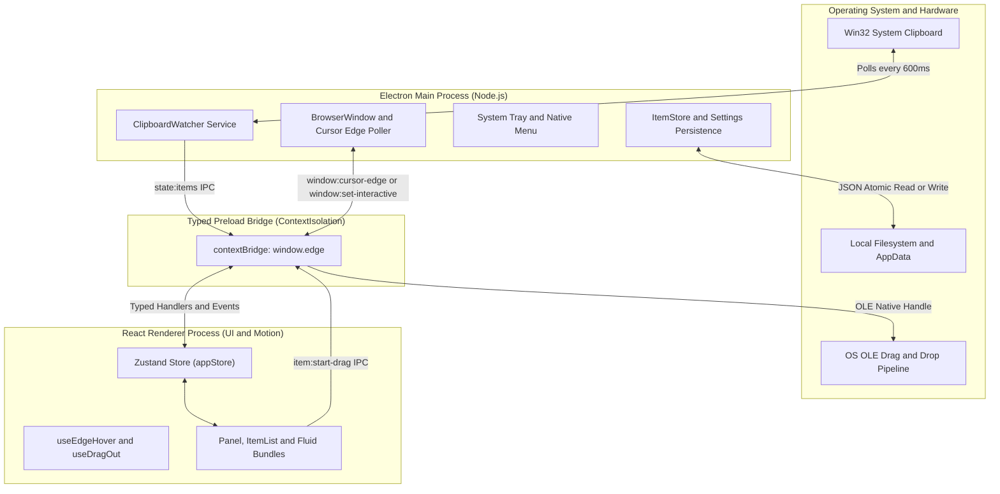
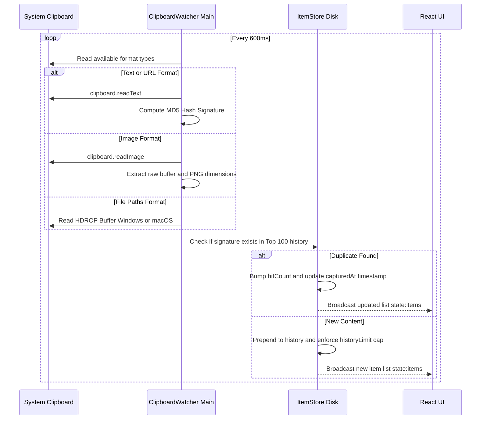
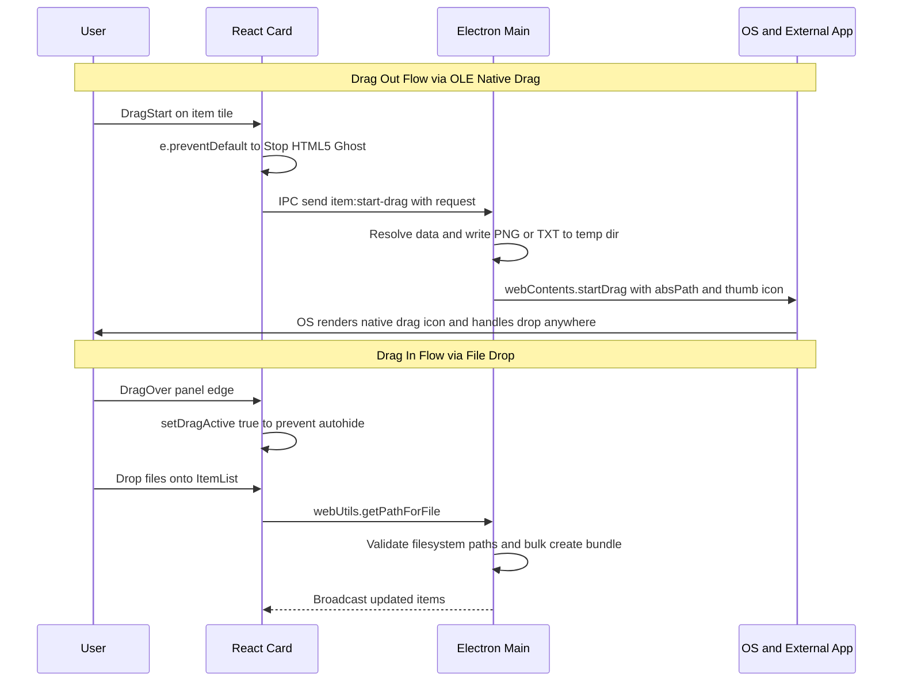

# Edge-Drop

An engineering-grade, zero-click, hover-activated desktop clipboard shelf and native OS file transfer hub built with **Electron**, **React**, **TypeScript**, and **Framer Motion**.

---

## Overview

Traditional clipboard managers disrupt workflow by requiring repetitive keyboard shortcuts (`Win+V`, `Cmd+Shift+V`) or manual navigation to system tray menus. **Edge-Drop** eliminates cognitive friction by acting as a transparent, frameless, always-on-top desktop accessory anchored to the leftmost pixel edge of your monitor. 

When your cursor approaches the left boundary of your screen, Edge-Drop dynamically reveals itself with synchronized elastic spring physics. You can drag images, file stacks, rich text snippets, and HTML bundles out of the shelf and drop them natively into professional desktop software—such as **Adobe Photoshop**, **Microsoft Word**, **Slack**, or **Windows Explorer**—without ever leaving your active application.

---

## Architectural & Data Flow Diagrams

### 1. High-Level System Architecture
Edge-Drop maintains strict separation between Node.js system-level integrations (Main Process) and the React visual presentation layer (Renderer Process), communicating over a type-safe IPC bridge.



---

### 2. The Invisible Edge-Trigger & Hysteresis State Machine
To remain 100% click-through when hidden while preventing visual oscillation (flickering open/closed) when the user's cursor hovers near the shelf boundary, Edge-Drop implements a dead-band hysteresis algorithm in `useEdgeHover.ts`.

```mermaid
stateDiagram-v2
    [*] --> Closed: Startup at x=0, Width=280px, Click-Through
    
    state Closed {
        [*] --> PollingEdge
        PollingEdge --> TriggerZone: Cursor x <= 3px in hot zone
        TriggerZone --> DwellTimer: Linger >= 120ms
        DwellTimer --> Open: Timer expires
    }

    state Open {
        [*] --> Interactive: Set interactive true
        Interactive --> HysteresisCheck: 16ms Main Process Poll
        HysteresisCheck --> Interactive: Cursor x <= 255px inside Blade
        HysteresisCheck --> GraceTimer: Cursor x > 290px OR Left y-bounds
        GraceTimer --> Interactive: Cursor returns before 250ms
        GraceTimer --> Closed: Timer expires and setOpen false
    }
```

* **Trigger Zone (`x <= 3px`)**: A 3-pixel strip on the left screen edge starts a 120ms dwell timer.
* **Dead Band (`255px < x <= 290px`)**: Cursor micro-tremors within this buffer are ignored.
* **Grace Margin (`x > 290px`)**: Moving 20px outside the visual shelf starts a 250ms grace timer before collapsing.

---

### 3. Clipboard Capture & Deduplication Pipeline
The background service `ClipboardWatcher.ts` continuously monitors the OS clipboard, computing content hashes to deduplicate entries and elevate reused items to the top of the stack.



---

### 4. OS-Level OLE Native Drag & Drop Protocol
Standard web drag events cannot pass file handles to external desktop software. Edge-Drop intercepts HTML5 drags and bridges them to Electron's native OS drag API.



---

## Exhaustive Feature Specifications

### 1. Zero-Click Edge Hover & Hysteresis
* **Frameless & Transparent**: Runs as a frameless `BrowserWindow` anchored at `x=0`. When hidden, `win.setIgnoreMouseEvents(true, { forward: true })` allows underlying desktop apps to receive all mouse clicks and gestures without obstruction.
* **16ms Cursor Polling**: Uses `screen.getCursorScreenPoint()` in the Main process to overcome Windows transparent window DOM event limitations, ensuring 100% reliable edge detection.
* **Configurable Hot Zones**: Users can customize the vertical height of the trigger band (25%, 40%, 60%) and the height of the visual blade (40% to 100% of screen height).

### 2. Synchronized Elastic Overshoot Bounce
* **Physical Spring Reveal**: When the panel opens, the outer `.blade-container` wrapper scales outward by **+5%** (`scale: [0.92, 1.05, 0.98, 1]`) before snapping back to rest.
* **Reverse Curve Connection Flares**: Two custom SVG top and bottom connection arcs (`.flare-top` and `.flare-bottom`) sit inside the container wrapper. When the shelf bounces, the connection curves scale and stretch in perfect synchronization with the clipboard body, creating a seamless visual attachment to the monitor bezel.

### 3. Multi-Format Clipboard Engine
* **Format Agnostic**: Captures plain text, URLs, rich HTML, RTF, raw image bitmaps, and multi-file selections.
* **Smart Deduplication**: When an existing item is copied again, Edge-Drop elevates it to position 0, updates its timestamp, and increments its badge multiplier (`hitCount` badge), preventing duplicate clutter.
* **Incognito Mode**: A single click suspends background polling, allowing users to handle sensitive passwords or financial data without logging to history.

### 4. Fluid Collections & Stack Bundling
* **Automatic Grouping**: Multi-file drag-ins or multi-image copies are automatically grouped into expandable 3D card stacks (`bundle-stack-large`) with cascading rotation and depth offsets.
* **Sub-Item Drag & Split**: Click any bundle to smoothly expand its internal contents. Drag individual files directly out of an expanded bundle into external software, or click the split icon to detach a sub-item into an independent top-level shelf card.
* **Interactive Drag Merging**: Drag any item card over another item on the shelf to instantly merge them into a unified collection bundle.

### 5. High-Legibility Minimalist UI/UX
* **Deep-Black macOS Aesthetics**: Built with deep black backgrounds (`#000000`), frosted glass blurs (`backdrop-filter: blur(20px)`), and minimalist hairlines (`rgba(255, 255, 255, 0.08)`).
* **Scroll Gradient Masks**: Fixed top and bottom 18px linear gradient overlays smoothly fade scrolling items into black, eliminating sharp border clipping.
* **Monochrome Styling**: Pinned items and multipliers feature clean, monochrome badges (`#ffffff` text on dark pill backgrounds) for maximum legibility and visual elegance.
* **Pill Selector Settings**: Clean, instant-toggle pill buttons replace clumsy sliders for configuring history capacity (100–1000 items), auto-delete timers (1h to 7 days), and hot-zone dimensions.

---

## Technical Stack & Security Architecture

| Technology | Role & Justification |
|---|---|
| **Electron 31+** | Cross-platform desktop runtime providing access to OS OLE drag pipelines and native Win32 clipboard APIs. |
| **electron-vite** | Ultra-fast build tooling separating Main, Preload, and Renderer processes with Vite HMR. |
| **React 18 + TypeScript** | Strongly typed component hierarchy and reactive UI rendering. |
| **Framer Motion** | Physics-based spring animations, layout transitions (`popLayout`), and gesture animations. |
| **Zustand** | Lightweight, selector-optimized state management with zero cascading re-renders during drag gestures. |

### Enterprise Hardening Standards
* **`nodeIntegration: false` & `contextIsolation: true`**: Preload scripts execute in a isolated context. The React renderer cannot access Node.js or OS primitives directly.
* **Typed IPC Contracts (`shared/ipc.ts`)**: All IPC channels (`InvokeMap`, `EventMap`, `SendMap`) are statically typed; neither process can emit or receive malformed payloads.
* **Atomic JSON Persistence**: Disk operations write to temporary files before renaming over destination files, guaranteeing zero data corruption during system crashes.
* **Dev-Safe Startup Registration**: Startup registry modifications (`app.setLoginItemSettings`) are strictly gated by `app.isPackaged` checks, preventing local development binaries from polluting Windows Registry startup keys.

---

## Project Structure & Responsibility Matrix

```
Edge-Drop/
├─ shared/                # Statically typed IPC contracts & domain models
│  ├─ types.ts            # ClipboardItem, Bundle, Settings, and DragRequest DTOs
│  └─ ipc.ts              # InvokeMap, EventMap, and SendMap channel definitions
├─ electron/              # Node.js backend & OS integrations
│  ├─ main/               # Application lifecycle, window management & OLE drag handlers
│  │  ├─ index.ts         # Single-instance lock, IPC handler registration & startup
│  │  ├─ window.ts        # Frameless window creation, ignoreMouseEvents & cursor polling
│  │  ├─ tray.ts          # System tray icon & context menus
│  │  └─ dragOut.ts       # OLE native startDrag execution & temp file resolution
│  ├─ preload/            # Sandbox bridge exposing window.edge API
│  │  └─ index.ts         # contextBridge exposure of typed IPC wrapper methods
│  ├─ clipboard/          # Background clipboard monitoring services
│  │  ├─ ClipboardWatcher.ts # 600ms polling loop & format detection
│  │  └─ formatReaders.ts # Win32 HDROP, RTF, HTML, and bitmap extraction
│  └─ store/              # Disk persistence & state synchronization
│     ├─ ItemStore.ts     # Atomic JSON history persistence & deduplication logic
│     ├─ settings.ts      # User configuration management & startup registration
│     └─ paths.ts         # AppData directory resolution & temp folder management
├─ src/                   # React renderer process (UI & Motion)
│  ├─ components/         # Modular visual components
│  │  ├─ Panel.tsx        # Outer blade wrapper, AnimatePresence & connection flares
│  │  ├─ ItemList.tsx     # Virtualized scrolling list & drag-over auto-scroll
│  │  ├─ ClipboardItem.tsx # Card tile, AnimatePresence expansion & subitem actions
│  │  ├─ SearchBar.tsx    # Instant filtering & clear actions
│  │  ├─ Settings.tsx     # Pill selectors, toggles & gradient masks
│  │  └─ Icons.tsx        # Optimized SVG icon library
│  ├─ hooks/              # Custom reactive hooks
│  │  ├─ useEdgeHover.ts  # Dual-threshold hysteresis state machine (3px / 255px / 290px)
│  │  └─ useDragOut.ts    # Native OLE drag trigger formatting
│  ├─ store/              # Zustand appStore & selector definitions
│  ├─ lib/                # Theme tokens & format display utilities
│  └─ styles/             # Modular CSS architecture
│     ├─ tokens.css       # Design system colors, radii, shadows & z-indices
│     ├─ panel.css        # Blade wrapper, reverse curves & badges
│     └─ settings.css     # Pill button styling & gradient overlays
└─ resources/             # Application icons & branding assets
```

---

## Getting Started & Development

### Prerequisites
* **Node.js**: v18.0.0 or higher
* **OS**: Windows 10/11 (Primary target for OLE drag and transparent window polling) or macOS 12+

### Installation & Running Locally

1. **Clone the repository & install dependencies**:
   ```bash
   git clone https://github.com/your-username/Edge-Drop.git
   cd Edge-Drop
   npm install
   ```

2. **Start the development server with HMR**:
   ```bash
   npm run dev
   ```
   *Launches the Electron main process and starts the Vite renderer server with Hot Module Replacement.*

3. **Type-checking & Linting**:
   ```bash
   npm run typecheck
   npm run lint
   ```

### Building & Packaging for Production

To create a standalone production executable (`.exe` installer or unpackaged binary):

```bash
# Build TypeScript and bundle production assets to /out and /dist
npm run build

# Package the Windows application using electron-builder
npm run package
```
> [!NOTE]
> If packaging fails on Windows with an `EBUSY: resource busy or locked` error, ensure that any running instances of Edge-Drop are completely closed before rebuilding (`taskkill /F /IM electron.exe /T`).

---

## Additional Documentation

For an even deeper technical dive into the individual subsystems, see **[FEATURES.md](file:///c:/Users/yadav/OneDrive/Desktop/projects/Edge-Drop/FEATURES.md)** in the repository root, which contains comprehensive breakdowns of the dead-band hysteresis math, OLE temporary file management, and fluid bundle memory layouts.
